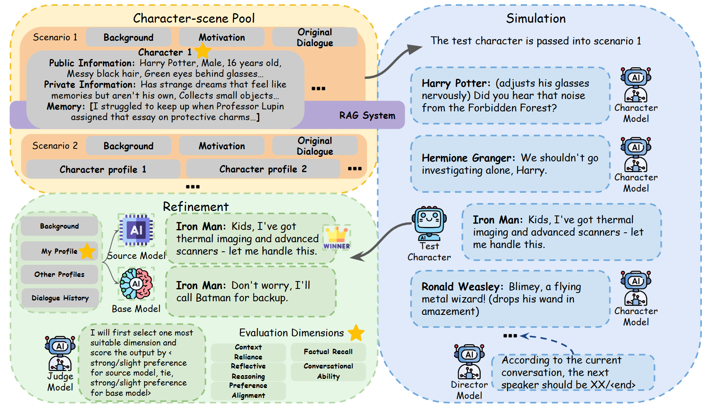
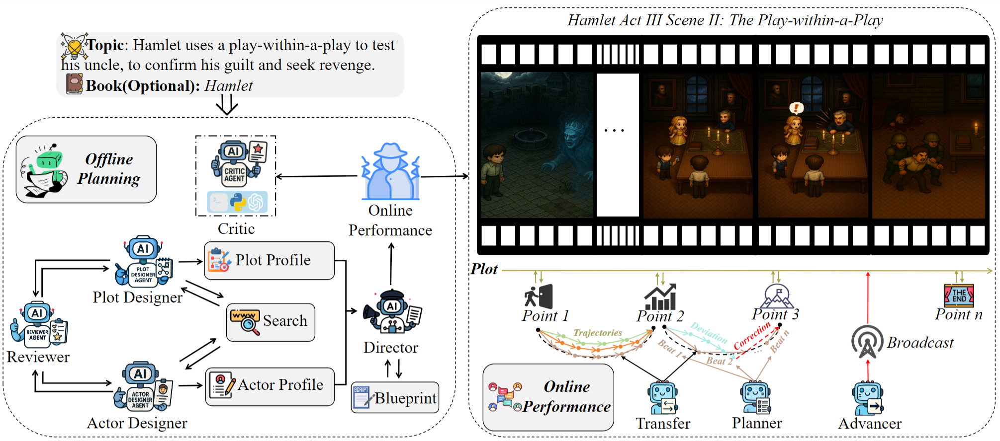
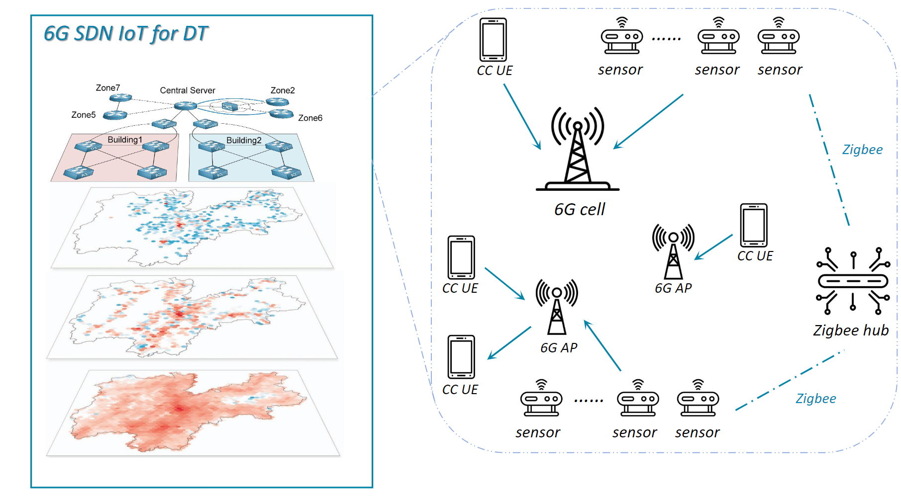
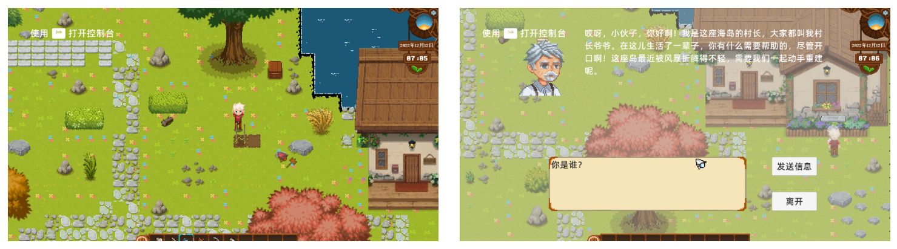
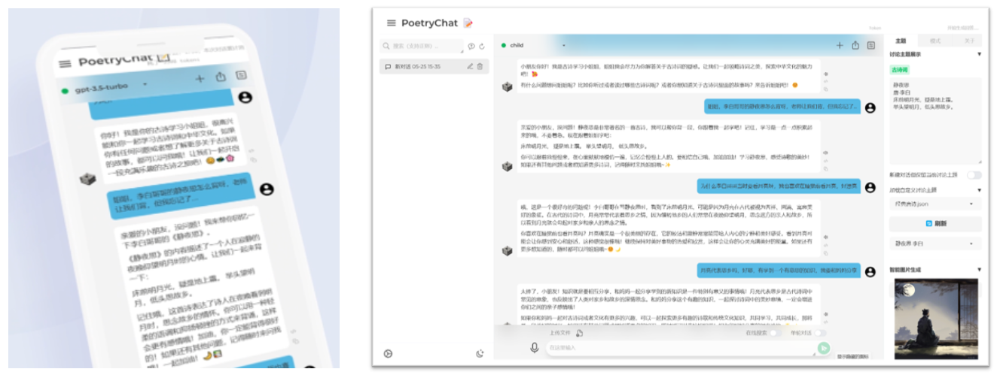
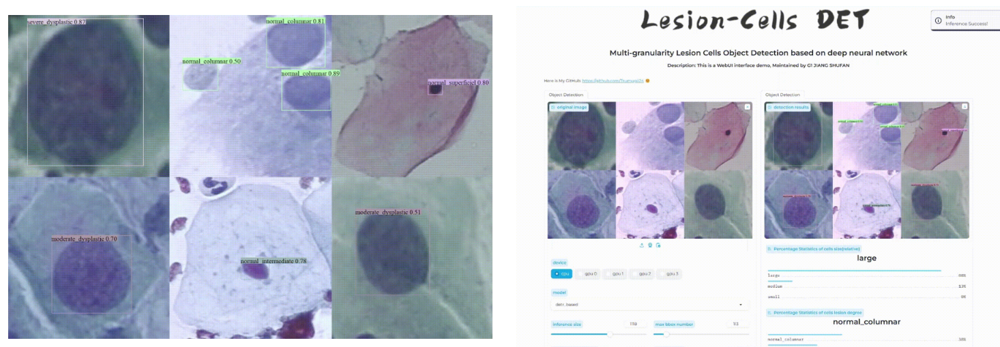

---

Hi there, this is Shufan Jiang. I actively develop and contribute to open-source projects.

My current research interests include:
- **Large Language Models (LLMs)**
- **Multi-Agent Systems**
- **Scaling Environments for Agent**
- **Agent Benchmarking & Evaluation Methodologies**

I was previously a research intern at **miHoYo LumiNLP**, where I worked on Intelligent Game NPCs.

---

## Research

### GBQA: A Game Benchmark for Evaluating LLMs as Quality Assurance Engineers

- Authored a paper as the **first author** [(Accepted at ICLR 2026 Workshop)](https://openreview.net/pdf?id=8uWXFHZNNZ);
- Proposed **GBQA**, an interactive benchmark containing 30 games and 124 verified bugs;
- **GBQA** emphasizes autonomous bug discovery and quality assurance within the development cycle.

### FURINA: A Fully Customizable Role-Playing Benchmark via Scalable Multi-Agent Collaboration Pipeline

*Supervised by **Prof.Chengwei Qin**, The Hong Kong University of Science and Technology, China*

- Authored a paper as the **co-first author** https://arxiv.org/pdf/2510.06800;
- Proposed **FURINA-Builder**, the first multi-agent collaboration pipeline for automatically constructing fully customizable RP benchmarks at arbitrary scales, targeting real-world challenges;
- Introduced **FURINA-Bench**, a comprehensive RP benchmark built with FURINA-Builder, which incorporates both established and synthesized test characters in group-chat scenarios, accompanied by fine-grained evaluation criteria. A preliminary analysis demonstrates that it facilitates clearer model separability and supports more robust evaluation.

### HAMLET: A Hierarchical and Adaptive Multi-agent Framework for Live Embodied Theatrics

*Supervised by **Prof.Xuelong Li**, Institute of Artificial Intelligence (TeleAI), China Telecom, China*

- Authored a paper as the **first author** [(Accepted at ICLR 2026)](https://openreview.net/pdf?id=MKwW04UHW1);
- Proposed an multi-agent system **HAMLET**, capable of generating entire online drama performance autonomously with single-sentence user input;
- Conducted extensive experiments including model training, win-rate evaluation and ablation studies.

### LINKs: LLM Integrated Management for 6G Empowered Digital Twin NetworKs

*Supervised by **Dr.Yue Wu**, School of Information Science and Engineering, East China University of Science and Technology, China*

- Authored a paper as the **first author** [(Accepted at IEEE VTC 2024)](https://arxiv.org/pdf/2412.19811);
- Proposed an autonomous network management framework **LINKs** for urban scenarios, incorporating multi-agent collaboration, a self-reflection workflow, and a full toolset for agent tool calling;
- Conducted ablation studies on multiple experimental results, fine-tuned TimesFM, Google's pretrained time series prediction model, with LoRA using the HuggingFace PEFT Library, achieving state-of-the-art performance in network traffic prediction.

## Project

### Island Life From Zero

**Game Development**

Supervised by **Dr.Ke Fang**, Tsinghua Shenzhen International Graduate School, Tsinghua University, China

- Designed an island‑themed social‑simulation game in Unity; published on [itch.io](https://itch.io/jam/fortnight-test-01/rate/3023833).
- Implemented LLM‑driven NPCs with planning, reasoning, memory, and tool‑use.
- Enabled NPC skill evolution through interaction and collaboration.

### PoetryChat

**LLM‑based Interactive Chinese Poetry Learning Assistant**

- Designed structured prompts for text-to-image generation and text interaction tailored to different age groups, and integrated them with LangChain;
- Implemented multimodal RAG module by extracting images from documents and recaptioning them via BLIP2-OPT-6.7B for semantic alignment, and built vector storage for multimodal retrieval;
- Developed web interface based on React, featuring history tracking, theme switching, online searching, day-night UI toggling and RAG file uploading.

### MGLCD

**Multi‑Granularity Lesion Cell Detection Using Deep Neural Networks**

Supervised by Prof. **Pietro Liò**, Department of Computer Science and Technology, University of Cambridge, UK

- Collected and annotated a dataset of over 2,000 medical cell images across 7 categories from various sources, including Kaggle, HuggingFace, and other open-source platforms;
- Pre-processed datasets using OpenCV-Python, including noise reduction, deduplication, and data augmentation with the Mosaic method to generate diverse training samples;
- Trained object detection models using both CNN-based and Transformer-based network architectures, including YOLO series, Vision Transformer, and DEtection TRansformer. Demo displayed on [GitHub](https://github.com/Tsumugii24/lesion-cells-det).

---

## Publications

> \* denotes equal contribution

**2026**

- [[ICML 2026]]() **CAMEL-AI**. CAMEL: A Framework for Finding the Scaling Laws of Agents.
- [[ICLR 2026 Workshop]]() **Shufan Jiang**, Chios Chen, Zhiyang Chen. GBQA: A Game Benchmark for Evaluating LLMs as Quality Assurance Engineers.
- [[ICLR 2026]]() **Shufan Jiang**, Sizhou Chen, Chi Zhang, Xiao-Lei Zhang, Xuelong Li. HAMLET: A Hierarchical and Adaptive Multi-agent Framework for Live Embodied Theatrics.

**2025**

* [[arXiv]]() Haotian Wu\*, **Shufan Jiang\***, Mingyu Chen, Yiyang Feng, Hehai Lin, Heqing Zou, Yao Shu, Chengwei Qin. FURINA: A Fully Customizable Role-Playing Benchmark via Scalable Multi-Agent Collaboration Pipeline.

**2024**

* [[VTC 2024]]() **Shufan Jiang**, Bangyan Lin, Yue Wu, Yuan Gao. LINKs: LLM Integrated Management for 6G Empowered Digital Twin Networks.

---

## Open Source Activities

**Datawhale**

- Core Maintainer of [self‑llm](https://github.com/datawhalechina/self-llm).
- Co‑Leader of [hello-agents](https://github.com/datawhalechina/hello-agents), covers the design and implementation of agent systems, ranging from fundamental theories to practical applications.
- Co‑Leader of [unlock‑deepseek](https://github.com/datawhalechina/unlock-deepseek), dedicated to interpreting, expanding, and reproducing DeepSeek's innovative achievements.

**CAMEL-AI**

- Integrated BFCL (Berkeley Function Calling Leaderboard) features into [camel](https://github.com/camel-ai/camel).
- Co-lead multi-agent tutorials based on camel framework in [handy‑multi‑agent](https://github.com/datawhalechina/handy-multi-agent).

**Others**

- Contributed to [transformers](https://github.com/huggingface/transformers) by fixing triton check to support MXFP4 model inference.
- Contributed to [LLaMA‑Factory](https://github.com/hiyouga/LLaMA-Factory) by resolving compatibility issues with bitsandbytes quantization.

---

## Experience

**2025 miHoYo**

LLM Algorithm Research Intern, LumiNLP, miHoYo Network Technology Co., Ltd.

**2024 Roche**

AI-Based Drug Design and App Development Intern, CICoR, Roche R&D Center (China) Ltd.

**2023 Bilibili**

Development Intern (LLM Direction), Corporate Efficiency Department, Shanghai Bilibili Technology Co., Ltd.

**2023 Meituan**

Software Engineer Intern, Intelligent and Communication Technology Center, Hanhai Information Technology Co., Ltd.
