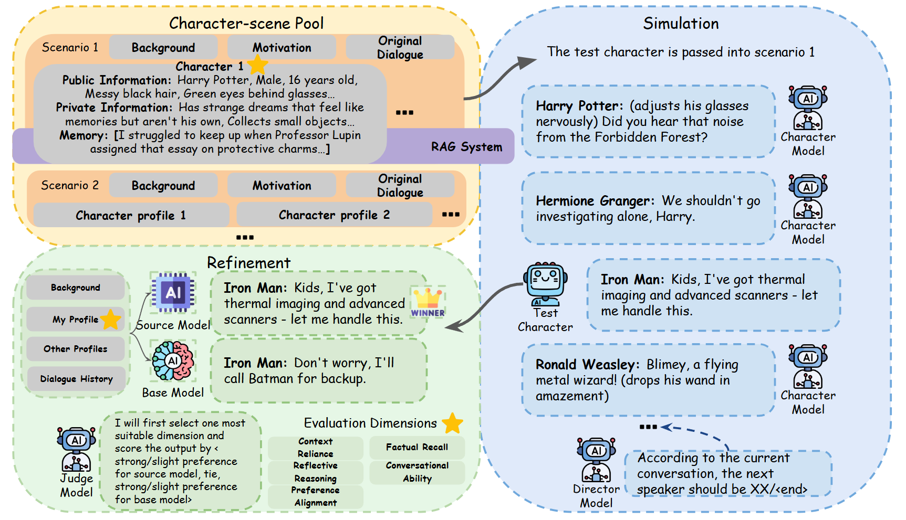
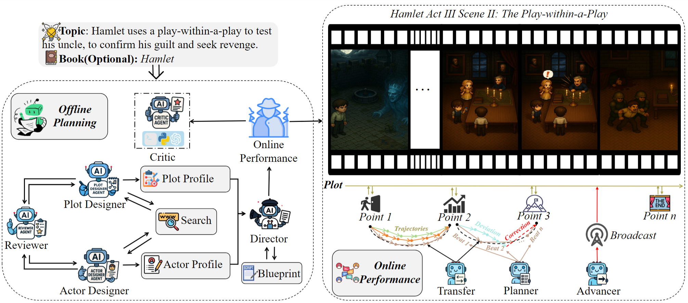
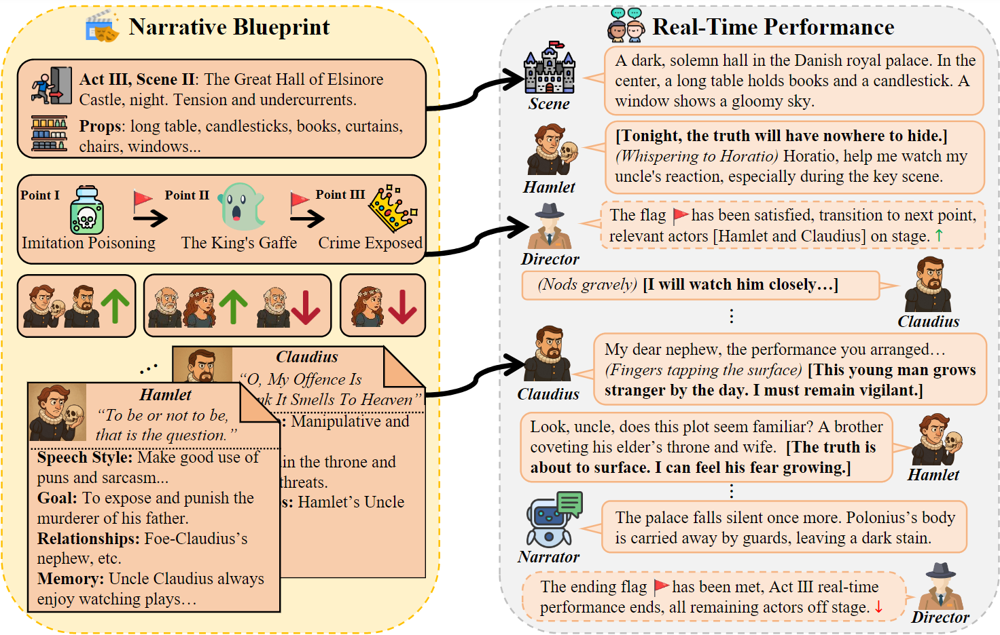
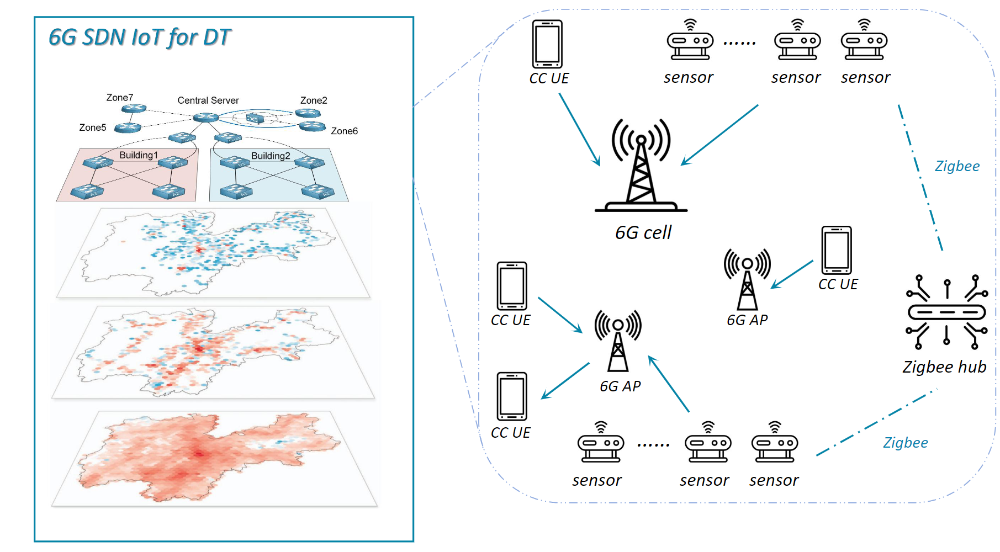
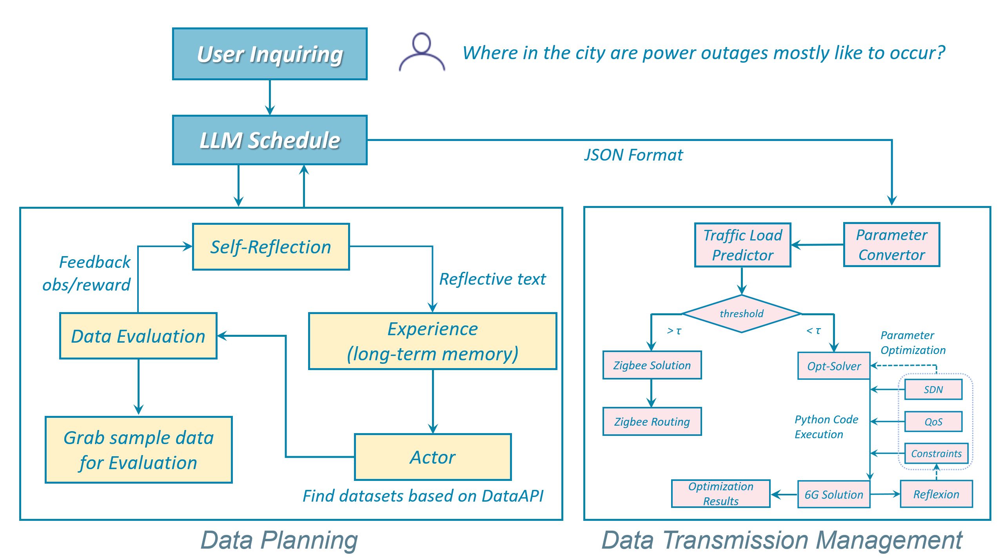
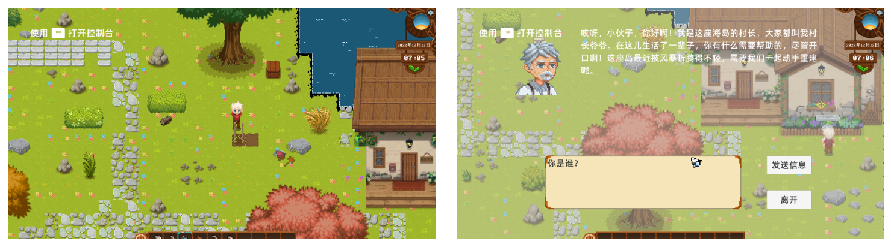
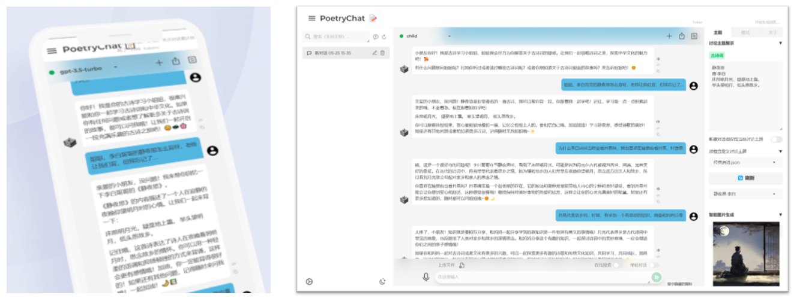
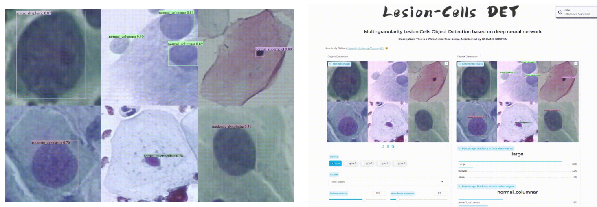

---

Hi there, this is Shufan Jiang. 
My current research interest includes **Large Language Models**, **World Models**, **Multi-Agent Systems**, and **Scaling Environment for Agents**.

I'm previously a research intern at **miHoYo**.

---

# Education

* Master of Science, The Hong Kong Polytechnic University, Hong Kong, China 2025 - 2027(expected)

* Bachelor of Engineering, East China University of Science and Technology, Shanghai, China 2021 - 2025

---
# Research and Project

### CustomRPBench

**Build Your Own RP Benchmark: A Multi-agent Collaboration Framework for Fully Customizable Role-Playing Conversation (CustomRPBench)** 

### HAMLET

**Hyperadaptive Agent‑based Modeling for Live Embodied Theatrics (HAMLET)** 

Supervised by Prof. **Xuelong Li**, Institute of Artificial Intelligence (TeleAI), China Telecom, China

- Co‑first author; preprint: [arXiv:2507.15518](https://arxiv.org/pdf/2507.15518).
- Proposed HAMLET, a multi‑agent system that generates complete online drama performances from a single user instruction.
- Conducted model training, win‑rate evaluation, and ablation studies.

This is our demonstration of core multi-agent system design for AI-Driven Drama.

### LINKs

**LLM Integrated Management for 6G Empowered Digital Twin Networks (LINKs)** 

Supervised by Dr. **Yue Wu**, School of Information Science and Engineering, East China University of Science and Technology, China

- First author; accepted at IEEE VTC2024‑Fall; preprint: [arXiv:2412.19811](https://arxiv.org/pdf/2412.19811).
- Built an autonomous network management framework featuring multi‑agent collaboration, self‑reflection, and a comprehensive tool‑use stack.
- Fine‑tuned `TimesFM` with `LoRA`, achieving SOTA performance on network traffic prediction.

### Island Life From Zero

**Game Development**

Supervised by Dr. **Ke Fang**, Tsinghua Shenzhen International Graduate School, Tsinghua University, China

- Designed an island‑themed social‑simulation game in Unity; published on [itch.io](https://itch.io/jam/fortnight-test-01/rate/3023833).
- Implemented LLM‑driven NPCs with planning, reasoning, memory, and tool‑use.
- Enabled NPC skill evolution through interaction and collaboration.

### PoetryChat

**LLM‑based Interactive Chinese Poetry Learning Assistant**

- Designed structured prompts for text‑to‑image generation and dialogue across age groups; integrated with LangChain.
- Implemented multimodal RAG by extracting document images and re‑captioning with BLIP2‑OPT‑6.7B for cross‑modal alignment; built vector stores for retrieval.
- Developed a React web app with history tracking, theme switching, web search, dark mode, and RAG file upload.

### MGLCD

**Multi‑Granularity Lesion Cell Detection Using Deep Neural Networks**

Supervised by Prof. **Pietro Liò**, Department of Computer Science and Technology, University of Cambridge, UK

- Curated and annotated 2,000+ medical cell images across 7 categories from Kaggle, Hugging Face, and other sources.
- Preprocessed with OpenCV (denoising, deduplication) and Mosaic augmentation for diversity.
- Trained CNN and Transformer‑based detectors (YOLO series, ViT, DETR).

---

# Publication

\* denotes equal contribution

**2025**

* [[AAAI 2026]]() Sizhou Chen\*, **Shufan Jiang**\*, Chi Zhang, Xiao-Lei Zhang, Xuelong Li. HAMLET: Hyperadaptive Agent‑based Modeling for Live Embodied Theatrics.

* [[ICLR 2026 WIP]]() 

**2024**

* [[VTC 2024]]() **Shufan Jiang**, Bangyan Lin, Yue Wu, Yuan Gao. LINKs: LLM Integrated Management for 6G Empowered Digital Twin Networks.

---

# Open Source Activities

**Datawhale**

- Delivered the talk ***How to Learn AI*** to over 200 attendees in AI+X Tour, ECUST.
- Supported learners as a Teaching Assistant (guidance, Q&A, grading).
- Co‑developed a summer camp course on [Multimodal Data Synthesis](https://tianchi.aliyun.com/competition/entrance/532251) with 1,000+ participants.
- Top‑3 core contributor to [self‑llm](https://github.com/datawhalechina/self-llm) (23k+ GitHub stars).
- Co‑leader of [unlock‑deepseek](https://github.com/datawhalechina/unlock-deepseek), expanding and reproducing DeepSeek innovations.

**CAMEL**

- Integrated BFCL (Berkeley Function Calling Leaderboard) features into [camel](https://github.com/camel-ai/camel).
- Co‑designed multi‑agent tutorials with runnable code in [handy‑multi‑agent](https://github.com/datawhalechina/handy-multi-agent).

**Others**

- Contributed to [transformers](https://github.com/huggingface/transformers) by fixing Triton version checks for MXFP4 inference support.
- Contributed to [LLaMA‑Factory](https://github.com/hiyouga/LLaMA-Factory) by resolving bitsandbytes quantization compatibility issues.

---

# Work Experience

**2025 miHoYo**

LLM Algorithm Research Intern, Lumi Group, miHoYo Network Technology Co., Ltd.

**2024 Roche**

AI-Based Drug Design and App Development Intern, CICoR, Roche R&D Center (China) Ltd.

**2023 Bilibili**

Development Intern (LLM Direction), Corporate Efficiency Department, Shanghai Bilibili Technology Co., Ltd.

**2023 Meituan**

Software Engineer Intern, Intelligent and Communication Technology Center, Hanhai Information Technology Co., Ltd.
